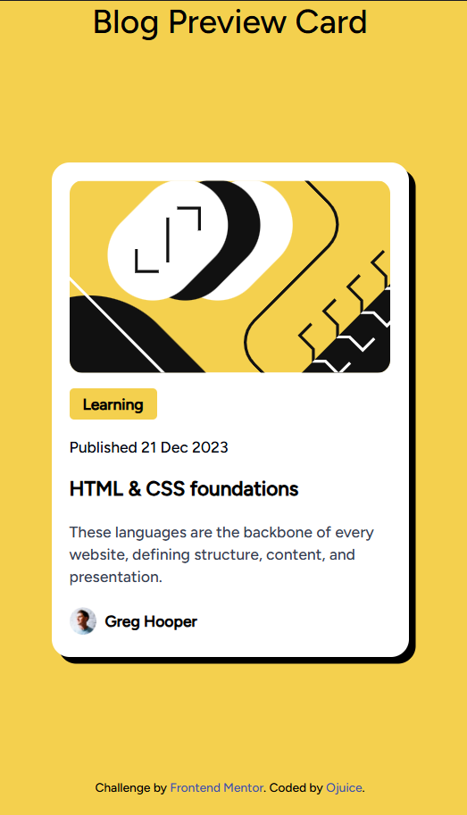
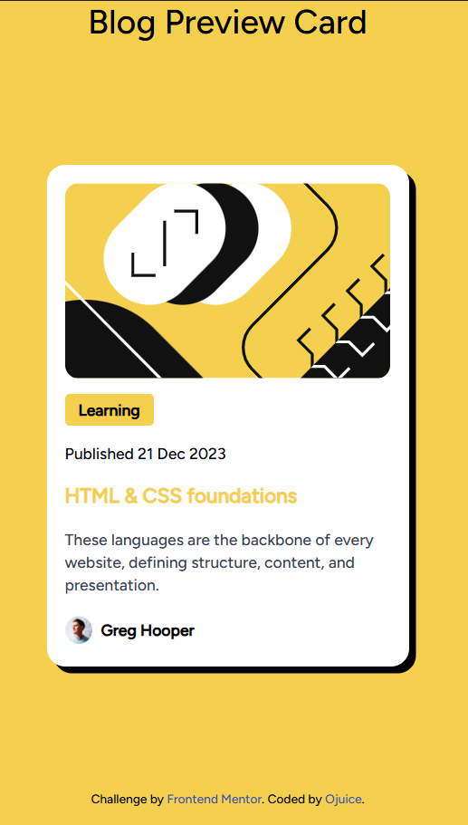

# Frontend Mentor - Blog preview card solution

This is a solution to the [Blog preview card challenge on Frontend Mentor](https://www.frontendmentor.io/challenges/blog-preview-card-ckPaj01IcS). Frontend Mentor challenges help you improve your coding skills by building realistic projects. 

## Table of contents

- [Overview](#overview)
  - [Screenshot](#screenshot)
- [My process](#my-process)
  - [Built with](#built-with)
  - [What I learned](#what-i-learned)
  - [Useful resources](#useful-resources)

## Overview

### Screenshot




## My process

### Built with

- HTML
- TailwindCSS

### What I learned

Working with box-shadows and arbitrary values for fine-tuning

To see how you can add code snippets, see below:

**input.css:**
```css
shadow-[6px_6px_0px_black]
```
6px	Horizontal offset → pushes shadow right
6px	Vertical offset → pushes shadow down
0px	Blur radius → sharp edge (no blur)
black	Shadow color


### Useful resources

- [Tailwind CSS Documentation](https://tailwindcss.com/docs/styling-with-utility-classes) - Quick reference to get specific utility class names